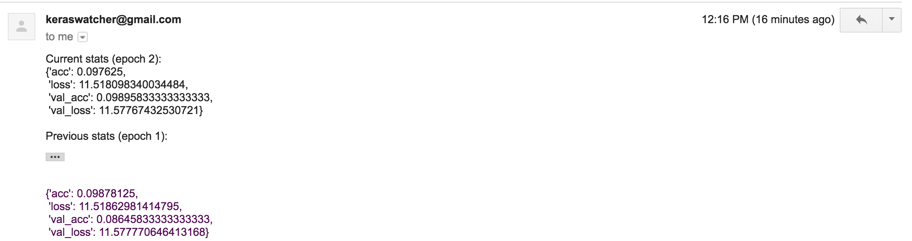

# Keras EmailMonitor
**Note: this is still a WIP**

Sends an email with stats at the end of every epoch.




#### Requirements:
```
python==3.6
tensorflow=1.8.0
keras==2.1.6
```

#### Todo:
- [x] Create example model
- [x] Send email from default Gmail account
- [ ] Define custom SMTP server (aka better security)
- [ ] Enable user to stop model training with an email
- [ ] PyTorch integration
